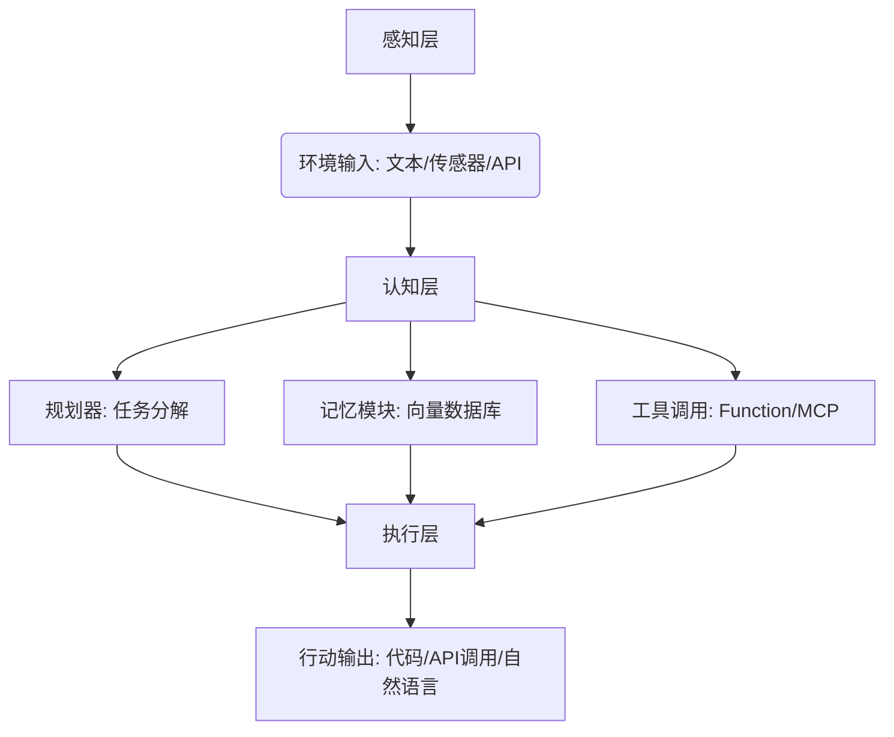
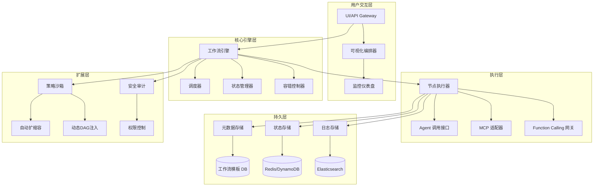
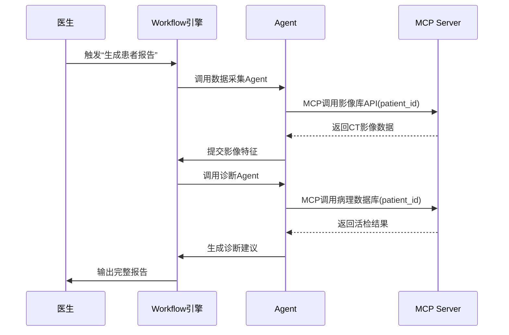
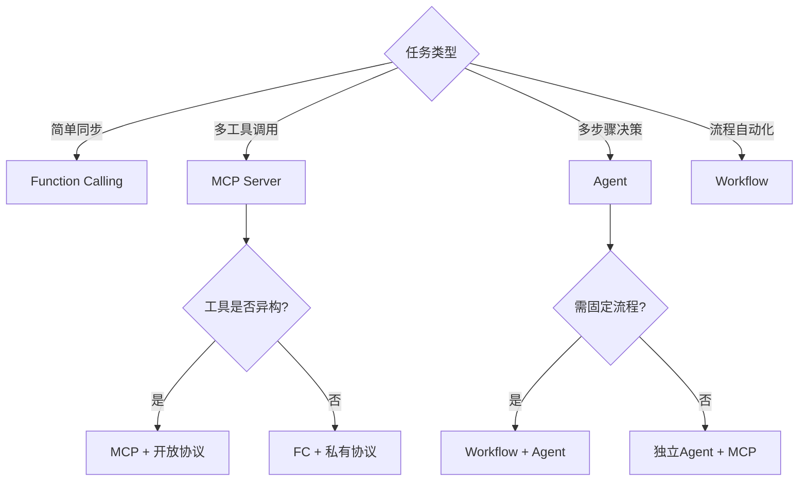
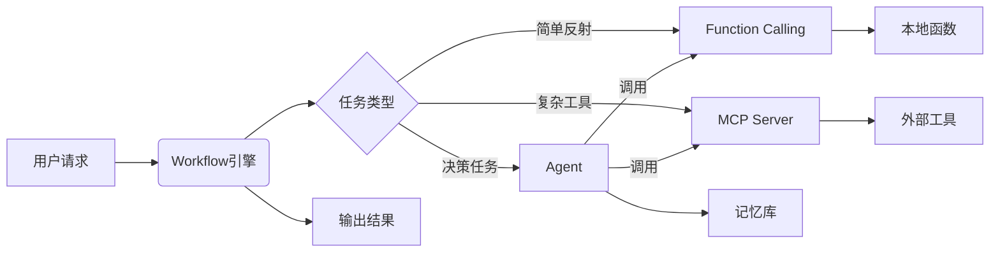
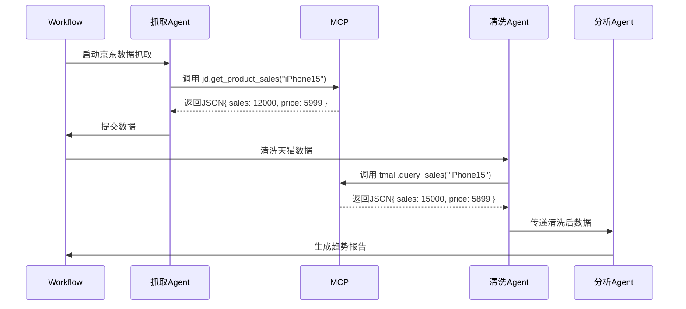

# AI 


## 自动化 L1 - L5 是如何划分？  
- L1: 辅助自动化，AI 简化流程，提供工具支持。   
- L2 - L3: 部分自动化，能独立生成内容但需人类设定条件。  
- L4: 高级自动化，AI 独立创作，有一定创新能力。    
- L5: 无安全自动化，AI 超越人类水平具备自我反思与创新能力


## 什么是大语言模型 LLM ？

语言模型简单说来，就是对人类的语言建立**数学模型**，语言模型是一个由数学公式构建的模型，并不是什么逻辑框架。    
让计算机理解人类的语言，不是像教人那样教它语法，而是最好能够让计算机计算出哪一种可能的语句概率最大。 
这种计算自然语言每个句子的概率的数学模型，就是语言模型。


## 数学模型如何计算概率？

- 阶段一：统计语言模型（Statistical Language Model，SLM）    
- 阶段二：神经网络语言模型（Neural Language Model，NLM）    
- 阶段三：预训练语言模型（Pre-trained Language Model，PLM）    
- 阶段四：大语言模型（Large Language Model）   

语言模型本质上都是在计算自然语言每个句子的概率的数学模型。当你输入一个问题给 AI 时，AI 就是用概率算出它的回答。    
当今的语言模型，并不是一个问题对一个答案，实际上是一个问题，多个答案，然后根据答案的概率进行排序，最后返回一个最可能的答案。


## 开发大语言模型需要什么？

- 关键一：数据    
- 关键二：算法（Transformers、DeepSpeed、Megatron-LM、JAX...）     
- 关键三：算力


## 大语言模型有什么缺点？

- 缺点一：结果高度依赖训练语料    
- 缺点二：Hallucinations（幻觉）胡说八道...
- 缺点三：暂时只能解决数学问题 出现无法预测的问题无法处理


## 什么是 Prompt？

它是给 AI 模型的指令。
它可以是一个问题、一段文字描述，甚至可以是带有一堆参数的文字描述。
AI 模型会基于 prompt 所提供的信息，生成对应的文本，亦或者图片。
写好一个 Prompt应该包含以下原则：
1. 包含完整的信息
2. 简洁易懂，并减少歧义
3. 使用正确的语法、拼写， 分隔符，以及标点
4. 请求结构化的输出（json）
5. 检查假设（如果...）
6. 使用示例（提供例子）
7. 从简单的先开始，并给模型多一点耐心和思考的时间


# 什么是 Prompt Engineering？

Prompt Engineering 是一种人工智能（AI）技术，它通过设计和改进 AI 的 prompt 来提高 AI 的表现。Prompt Engineering 的目标是创建高度有效和可控的 AI 系统，使其能够准确、可靠地执行特定任务。

> 现在 AI 的发展还比较早期，了解和学习 PE 价值相对比较大，但长远来看可能会被淘汰。


# Prompt Engineering 有哪些框架？

ICIO 框架
- Instruction： 指令，即你希望模型执行的具体任务。
- Context： 背景信息，或者说是上下文信息，这可以引导模型做出更好的反应。
- Input Data： 输入数据，告知模型需要处理的数据。
- Output Indicator： 输出指示器，告知模型我们要输出的类型或格式。

---

CRISPE 框架
- Capacity and Role：指定 AI 在交互中扮演的角色。
- Insight：提供背景和上下文。
- Statement：你要求 AI 做什么。
- Personality：输出的类型和风格。
- Experiment：输出多个例子。

---

TASTE 框架
- Task：任务。写一篇关于数据隐私重要性的简短博客文章。
- Audience：目标受众。普通的互联网用户，非技术背景。
- Structure：结构。文章需要有明确的开头、中间讨论和结尾，开头提出问题，中间介绍原因和印象，结尾提供建议。
- Tone：语气。采用友好、易懂的语气。
- Example：示例。类似《纽约时报》科技专栏的风格。

___

ALIGN 框架
- Aim：目标。创建一篇关于"可持续发展"的文章，解释其核心理念。
- Level：难度级别。适合高中生阅读，不需要专业术语。
- Input：输入。提供目前的环境问题的背景，讨论应对全球变暖的策略。
- Guidelines：指导原则。文章应使用简洁明了的语言，并避免复杂的技术概念。
- Novelty：新颖性。要求结合最新的环境数据，提出新颖的观点和解决方案。


# 什么是 AIGC ？

AIGC，全称为 AI Generated Content，意为“人工智能生成内容”。它指的是利用人工智能技术（尤其是大模型，如GPT、Stable Diffusion等）自动生成文本、图片、音频、视频等多种内容的过程。


# 什么是智能体 Agent ？

智能体 = 自治实体（感知→决策→执行） + 目标导向 + 环境交互  
一个能独立完成任务的“AI员工”。 能够感知环境、推理规划任务、调用工具（MCP Server & Function Call）、从过往经历汲取经验并完成目标。

> eg：输入一个“撰写AI趋势报告”的任务后，Agent 像一位熟练的工人，不仅能挑选最合适的工具自动抓取数据、分析内容，还能根据任务需求灵活组和工具完成复杂操作。　

Agent 的技术架构分层：



# 什么是工作流 Workflow？

工作流 = 任务编排引擎 + 状态管理 + 异常处理
将多个Agent或工具按有向无环图（DAG）连接，形成自动化流水线（节点编排引擎）。能够跨 Agent 传递数据，流程引擎会按预设规则调度而非 LLMs 自主判断。

Workflow 的技术架构分层：


一个“医疗报告生成”工作流的示例：

    关键数据流：
    所有节点状态由 状态管理器 持久化（避免Agent崩溃导致数据丢失）
    MCP调用自动携带 全局ContextID（关联同一患者的多次请求）

# 什么是函数调用 function calling？

一种机制，允许大语言模型 LLM 直接调用预定义函数的能力，允许模型生成参数并整合结果。  

解决大模型两大缺陷：
- 没有最新信息，不具备时效性。
- 没有真正的逻辑，本质上是概率学。

> eg：向 LLM 发送以下提示：“特斯拉当前的股价是多少？”   
> 得到的答案要么是“幻觉”，要么是“我没有实时数据，无法告诉你”。

FC 的特点：
- 极快（无网络延迟）
- 固定模式（输入输出明确）
- 不依赖记忆（单次调用）

# 什么是模型上下文协议 MCP ？

MCP，全称为 Model Context Protocol，是一个开源的协议标准。


# 为什么需要 MCP ？

为了整个 AI 行业的生态发展，作为一种标准出现是必然需求，解决了三个关键问题：
1. 数据孤岛：让 AI 可以链接万物
2. 开发低效：解决为每个 LLM 写 Function Call 的问题，一次编写所有大模型可用
3. 生态碎片化：作为一种标准让不同厂商可以即插即用
4. 支持复杂工作流与状态管理：Function Calling 难以维护多轮对话的中间状态（eg：用户查询航班后需手动传递航班号预定）

| 维度    | 传统模式         | MCP 模式       | 变革价值             |
|-------|--------------|--------------|------------------|
| 集成成本  | 每次对接新工具需定制开发 | 一次开发，全网复用    | 开发效率提升 10倍       |
| 功能范围  | 单一工具调用       | 多工具协同执行复杂任务链 | AI 从"助手"升级为"执行者" |
| 生态开放性 | 封闭式 API 被厂商卡 | 开源协议，社区共建工具库 | 催生 "AI 应用商店" 模式  |
| 安全可控性 | API 密钥暴露风险   | 数据不离域，权限分级管控 | 满足企业级合规需求        |


# MCP 架构和执行流程？

架构分为以下 3 部分：

- 客户端：大模型应用（DeepSeek、ChatGPT）发起请求
- 服务器：中间层，连接具体工具（数据库、设计软件）
- 资源：具体的数据或工具（Excel文件、网页 API）

运行流程：

1. 初始化与工具列表获取：
   - 用户首先启动 MCPClient，完成初始化操作。
   - MCPClient 向 MCPServer 发送 GET /tools/list 请求，获取可用工具的元数据。
   - MCPServer 返回包含工具名称、功能描述、参数要求等信息的 工具列表JSON，供客户端后续构建提示词使用。

2. 用户输入与提示词构建：
   - 用户通过 MCPClient 输入自然语言请求（如“查询服务器状态”“生成文件报告”等）。
   - MCPClient 将用户请求与初始化阶段获取的 工具列表 结合，生成包含任务目标和工具能力的提示词（Prompt），传递给 LLMService（大语言模型服务层）。

3. 工具传递方式选择（二选一）： 
   - 使用 Function Call（函数调用）直接携带工具列表信息。LLMService 通过 LLM_API 调用大语言模型时，在请求中直接携带 工具schema（结构化工具定义，如参数格式、调用格式），告知模型可用工具的调用方式。
   - 在系统提示词（System Prompt）中包含工具列表。LLMService 将工具列表以自然语言描述形式嵌入 系统提示词（System Prompt），让模型在理解用户需求时知晓可用工具的功能边界。

4. LLM判断与响应： 
   - 无需工具：LLM直接将处理结果通过 MCP Client 回复给用户；
   - 需要工具：
     1. 获取命令模板： MCP Client 根据模型指定的工具名称，在初始化时保存的工具配置中取出对应的 命令模板（如Shell命令格式、API调用参数模板）。 
     2. 生成与执行命令： MCP Client 将用户输入参数与命令模板结合，通过 ToolService（工具执行服务）生成完整可执行命令，并提交给 本地系统 执行。 
     3. 结果处理：本地系统 返回原始执行结果（如命令输出文本、API返回数据），ToolService 将其转换为结构化结果（JSON），反馈给 MCP Client。 
     4. 二次调用模型生成最终回复：MCPClient 将结构化结果与用户原始问题一并提交给 LLMService，通过 LLM_API 调用模型，将技术化的执行结果转化为自然语言描述（如将“服务器CPU使用率80%”转化为“当前服务器CPU负载较高，建议检查进程”）。

5. 工具命令生成与执行：
若需要工具， MCP Client 根据 LLM 提供的参数格式，以及 MCP Server 配置的命令模板进行拼接，生成完整的可执行命令，并在本地环境（Local_Env）中执行该命令。

6. 结果处理与输出：
本地环境执行命令后，将结果返回给 MCP Client。MCP Client 将执行结果提交给 LLM，由 LLM 对技术化的执行结果进行处理，最终以人性化的语言形式输出给用户。


# 什么是 MCP Client ？

一个 LLM 的遥控器，负责向 Server 发送指令并接受结果。充当翻译官的角色，把自然语言指令转换成 Server 能理解的请求格式。
它做要做三件事：
1. 构建请求：根据用户输入或 LLM 的需求构建出符合 MCP 协议的消息
2. 与 Server 通信：与 Server 建立连接并发送请求
3. 接受到 Server 返回的结果后解读这些信息并反馈给用户或者 LLM


# 什么是 MCP Server ？

一个工具箱，里面装满了各种工具（如爬虫、文件读写、数据库查询），但它不会主动使用这些工具，它允许大语言模型以一种标准化的方式调用。
它做要做三件事：
1. 提供工具：核心价值
2. 处理请求：收到 client 的请求后负责解析并根据请求内容执行相应的操作
3. 返回结果：完成操作后把结果返回给 client


# 基于 AI 编写 MCP Server

```text
## 需求

基于提供的 MCP 相关资料，帮我构建一个 MCP Server，需求如下：

- 提供一个获取当前时间的工具
- 接收时区作为参数（可选）
- 编写清晰的注释和说明
- 要求功能简洁、只包含关键功能
- 使用 TypeScript 编写

请参考下面四个资料：

## [参考资料 1] MCP 基础介绍

- 粘贴 https://modelcontextprotocol.io/introduction 里的内容。

## [参考资料 2] MCP 核心架构

- 粘贴 https://modelcontextprotocol.io/docs/concepts/architecture 里的内容。

## [参考资料 3] MCP Server 开发指引

- 粘贴 https://modelcontextprotocol.io/quickstart/server 里的内容。

## [参考资料 4] MCP Typescript SDK 文档

- 粘贴 https://github.com/modelcontextprotocol/typescript-sdk/blob/main/README.md 里的内容。
```

# 通讯协议 STDIO（标准输入输出）和 SSE（服务器推送事件）有什么区别？

- STDIO 协议是「面对面对话」把 MCP Server 也就是这个 Python 程序下载到本机并且本机运行，AI 客户端与 MCP Server 使用 STDIO 也就是操作系统的标准输入输出通道进行交互，无需网络连接。AI 客户端与 MCP Server 的距离更近一些。

- SSE 协议是「电话热线」把 MCP Server 也就是这个 Python 程序单独部署，AI 客户端与 MCP Server 使用 SSE 协议进行远程调用。AI 客户端与 MCP Server 的距离更远一些。

# Function Calling 和 MCP Server 和 Agent 和 Workflow 有什么区别？

| 维度    | Function Calling             | MCP Server             | Agent                  | Workflow                      |
|-------|------------------------------|------------------------|------------------------|-------------------------------|
| 本质定位  | 模型内置的轻量级工具调用接口（内部触发）         | 标准化的外部工具通信协议层（双向通信）    | 自主决策的任务执行实体（规划+工具调度）   | 任务编排引擎（多节点调度与状态管理）            |
| 协议性质  | 厂商私有（如OpenAI/Anthropic自定义格式） | 开放标准（JSON-RPC 2.0等）    | 无固定协议（可集成FC/MCP/自定义逻辑） | 依赖 DSL/YAML （Prefect/Airflow） |
| 架构设计  | 集成于模型内部，直接生成函数调用指令           | 分层架构（客户端-服务端解耦）        | 多模块协同（规划器+工具库+记忆模块）    | 有向无环图（DAG）驱动节点依赖              |
| 上下文管理 | 需开发者手动维护多轮对话状态               | 原生支持跨轮次参数传递与状态存储       | 主动维护任务链状态（自动记忆/回溯关键信息） | 全局状态跟踪（节点间数据持久化）              |
| 安全机制  | 依赖业务层实现权限控制                  | 内置会话加密、权限分级等企业级安全管控    | 沙箱隔离+运行时监控（防越权/死循环）    | 权限分级+审计日志                     |
| 使用场景  | 简单同步任务（天气查询、计算器、知识库问答）       | 复杂异步工作流（跨系统数据聚合、多步骤决策） | 长周期目标导向任务（旅行规划）        | 流程化作业（订单处理/报告生成）              |

决策树：

四者关系本质是：    
能力（FC）→ 连接（MCP）→ 思考（Agent）→ 行动（Workflow）

Function Calling = 神经末梢反射
  → 特性：快速、无意识、局部的
  
MCP Server = 工具握柄
  → 特性：标准化、安全、可扩展的

Agent = 大脑
  → 特性：决策、规划、自主的

Workflow = 神经中枢
  → 特性：编排、状态化、流程驱动的


# 如何实现“对比iPhone 15在京东和天猫的月销量，并分析价格趋势”这一个需求？

技术分工：

| 组件       | 职责                                                                                            |
|----------|-----------------------------------------------------------------------------------------------|
| Workflow | 编排流程：竞品抓取 → 数据清洗 → 趋势分析 → 报告生成                                                                |
| Agent 群  | - 抓取Agent：控制爬虫 <br> - 清洗Agent：过滤无效数据 <br> - 分析Agent：调用统计模型                                    |
| MCP      | 封装：<br> - 京东数据API → jd.get_product_sales(item_id) <br> - 天猫数据API → tmall.query_sales(item_id) |

执行流程如图：




# 什么是思维链 Chain-of-Thought ?

> 思维链是一种引导大模型进行逐步推理的提示工程技术，通过要求模型展示从问题到答案的完整思考过程，来提高复杂问题的解决能力。
> 这种方法特别适用于需要多步逻辑推理的任务，如数学问题求解、逻辑分析和复杂决策。思维链技术显著提升了模型在需要深度思考的任务上的准确性和可解释性。
> 模拟了人类解决问题的方法步骤，通过思考过程和任务分解等方法来解决复杂任务。


# 老虎机 vs Vibe Coding 怎么更合理使用 AI 工具？

合理运用 AI 辅助的关键是在每个环节都保持技术判断力，而不是把决策权交给AI。

| 老虎机                 | Vibe Coding             | 抓娃娃                     | AI辅助编程                         |
|---------------------|-------------------------|-------------------------|--------------------------------|
| 买代币(Tokens)         | 买 Tokens                | 买游戏币                    | 买 Tokens + 技术积累                |
| 拉动拉杆                | 写一段模糊的提示词，然后点击"生成"      | 仔细观察娃娃位置，精准操作摇杆         | 明确需求描述，让AI生成代码，然后review和优化     |
| 可能中大奖，也可能一无所获       | 可能得到完美应用，也可能是混乱代码       | 可能抓到心爱的娃娃，也可能抓了个寂寞      | 得到高质量、可维护的代码解决方案               |
| 没有测试，全凭开奖结果         | "能跑就行"，出问题再说            | 当场就能看出抓没抓到              | 完整的测试流程，问题提前发现                 |
| 闪烁的灯光！"大奖！"铃声！      | "绝妙的主意！""完美解决方案！"       | 成功的"咔嚓"声和娃娃掉落的满足感       | "测试通过，代码质量良好，可以部署了"            |
| "我有一套自己的赢钱系统"       | "我是一个提示词工程师"            | "我研究过爪子的抓力和娃娃的重心"       | "我懂业务逻辑，AI帮我提高开发效率"            |
| "再玩一次，我一定能赢回来"      | "再试一次提示词，这次肯定能修复这个Bug"  | "这个角度不对，让我调整一下策略"       | "让我分析问题根因，然后优化代码逻辑"            |
| 庄家总是赢家              | 模型厂商总是赢家                | 游戏厅老板总是赢家，但技术好的确实能多抓几个  | 程序员和用户都受益，技术能力持续提升             |
| 轻松赚钱："我赢了100万美元大奖！" | 轻松编程："我一个周末搭建了完整的SaaS！" | 技术展示："看我这套连抓技巧，成功率30%！" | 效率提升："这个功能用AI辅助，2小时完成了以前2天的工作" |
| "过去4小时去哪儿了？"        | "我花3小时生成一个20分钟就能写的函数？"  | "虽然花了1小时，但我真的抓到了限量版！"   | "包括需求分析、编码、测试，总共用了半天时间"        |
| 技术能力占比：0%           | 技术能力占比：10%              | 技术能力占比：40%              | 技术能力占比：80%                     |
| 运气依赖：100%           | 运气依赖：90%                | 运气依赖：60%                | 运气依赖：20%                       |

> 进阶之路在于转变

1. 心态转变：从"AI帮我写代码"到"我用AI优化编程"
   - 以前的想法：让AI帮我写代码，我负责调用    
   - 现在的想法：我主导整个开发过程，AI提高我的效率

2. 技能转变：从"提示词工程师"到"AI时代的程序员"
   - 需求分析能力：把业务需求转化为清晰的技术需求
   - 代码review能力：能快速判断AI生成代码的质量
   - 系统设计能力：知道如何拆解复杂问题
   - 测试思维：每个功能都要考虑测试用例
   
3. 工作流程的改变
   - 传统开发：需求分析 → 设计 → 编码 → 测试 → 部署
   - AI辅助开发：需求分析 → 任务拆解 → AI辅助编码 → 实时review → 测试验证 → 部署